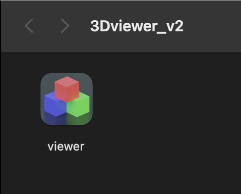
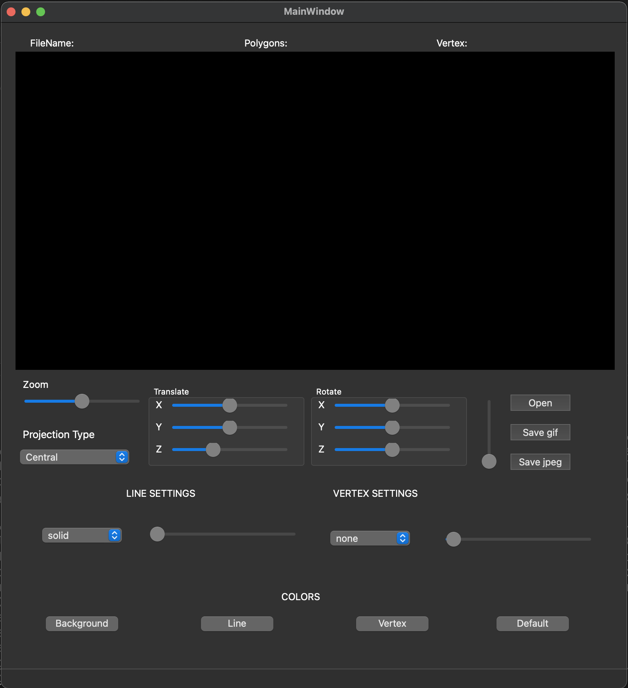
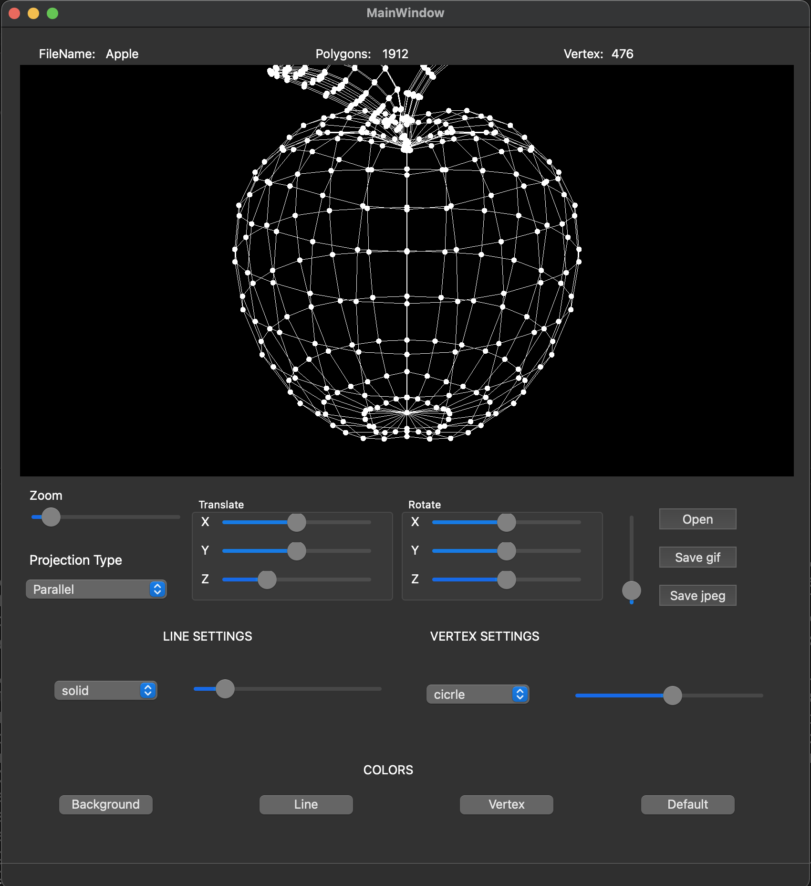
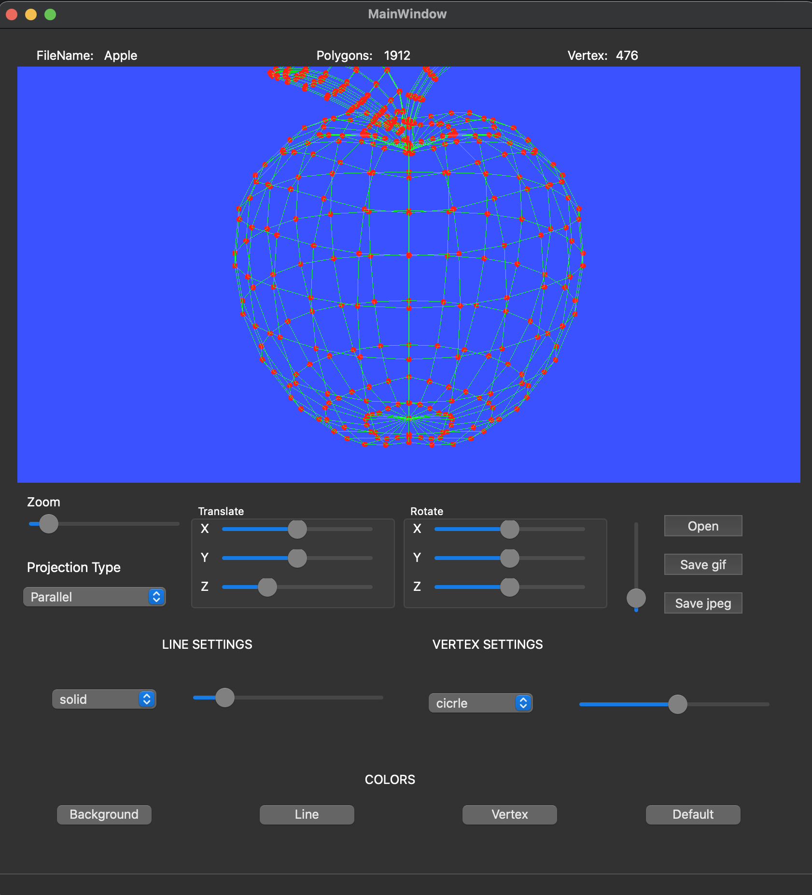
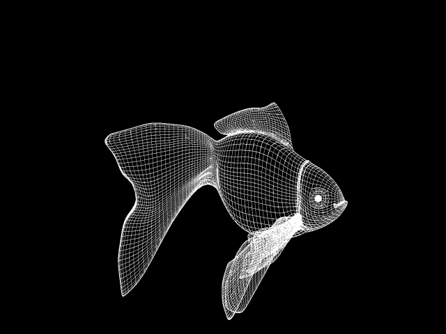

# 3DViewer v2.0

## Chapter I

## Introduction

В данном проекте реализовано приложение для просмотра 3D моделей в каркасном виде.

## Chapter II

## Information

### Паттерны проектирования

В любой человеческой деятельности, как, например, готовка еды или проведение экспериментов в области ядерной физики, существует некоторый набор устоявшихся практик, решающих базовые элементарные задачи. Они не требуют индивидуального подхода и обычно разрешаются устоявшимися за долгое время подходами, основанными на уже накопленном опыте предыдущих поваров или ядерных физиков. Например, для того чтобы испечь пирог, пусть даже и необычный, скорее всего понадобится тесто, технология приготовления которого заранее известна и обычно не требует некоторого творческого подхода. Так же и с программированием, при проектировании часто возникают элементарные задачи, с которыми до вас сталкивалось огромное число программистов, а их совокупный опыт вылился в устоявшиеся паттерны проектирования.

**Паттерн проектирования** описывает часто повторяющуюся при проектировании приложений задачу и принцип ее решения, который является универсальным для этой задачи. То есть для программиста паттерн проектирование ни что иное, как строительный блок, элементарная единица, которая реализуется в случае возникновения типовой подзадачи внутри проекта.

Обычно паттерны проектирования разделяют на три группы: порождающие паттерны, структурные паттерны и паттерны поведения. MVC в том или ином виде является одним из самых частых решений в плане структурирования кода в ходе разработки приложений с пользовательским интерфейсом. Пользовательский интерфейс и бизнес-логику с прилежащим к ней контроллером обычно разбивают на два различных глобальных домена: домен интерфейса и домен бизнес-логики.

Домен интерфейса отвечает только за отображение интерфейса и передачу команд домену бизнес-логики. Загруженные из файла данные не должны храниться в домене интерфейса.

Домен бизнес-логики отвечает за основную функциональность системы. Именно в нем хранятся загруженные данные, выполняются все операции над ними. Также в этом домене производится отрисовка.

С примерной предлагаемой диаграммой классов для домена бизнес-логики можете ознакомиться в материалах.

## Chapter III

## Part 1. 3DViewer v2.0

Программа для визуализации каркасной модели в трехмерном пространстве.

- Программа разработана на языке C++ стандарта C++17. 
- Код программы находится в папке src.
- При написании кода использован Google Style.
- Сборка программы настроена с помощью Makefile со стандартным набором целей для GNU-программ: all, install, uninstall, clean, dvi. Установка ведется в другой каталог.
- Программа разработана в соответствии с принципами объектно-ориентированного программирования.
- Программа предоставляет возможность:
    - Загружать каркасную модель из файла формата obj (поддержка только списка вершин и поверхностей).
    - Перемещать модель на заданное расстояние относительно осей X, Y, Z.
    - Поворачивать модель на заданный угол относительно своих осей X, Y, Z.
    - Масштабировать модель на заданное значение.
- В программе реализован графический пользовательский интерфейс, на базе GUI-библиотеки с API для C++ (Qt).
- Графический пользовательский интерфейс содержит:
    - Кнопку для выбора файла с моделью и поле для вывода его названия.
    - Зону визуализации каркасной модели.
    - Кнопку/кнопки и поля ввода для перемещения модели. 
    - Кнопку/кнопки и поля ввода для поворота модели. 
    - Кнопку/кнопки и поля ввода для масштабирования модели.  
    - Информацию о загруженной модели - название файла, кол-во вершин и ребер.
- Программа корректно обрабатывает и позволяет пользователю просматривать модели с деталями до 100, 1000, 10 000, 100 000, 1 000 000 вершин без зависания (зависание - это бездействие интерфейса более 0,5 секунды).
- Программа реализована с использованием паттерна MVC.
- Классы реализованы внутри пространства имен `s21`

## Part 2. Дополнительно. Настройки

- Программа позволяет настраивать тип проекции (параллельная и центральная)
- Программа позволяет настраивать тип (сплошная, пунктирная), цвет и толщину ребер, способ отображения (отсутствует, круг, квадрат), цвет и размер вершин.
- Программа позволять выбирать цвет фона.
- Настройки сохраняются между перезапусками программы.

## Part 3. Дополнительно. Запись
 
- Программа позволяет сохранять полученные ("отрендеренные") изображения в файл в форматах jpeg.
- Программа позволяет по специальной кнопке записывать небольшие "скринкасты" - текущие пользовательские аффинные преобразования загруженного объекта в gif-анимацию (640x480, 10fps, 5s)
